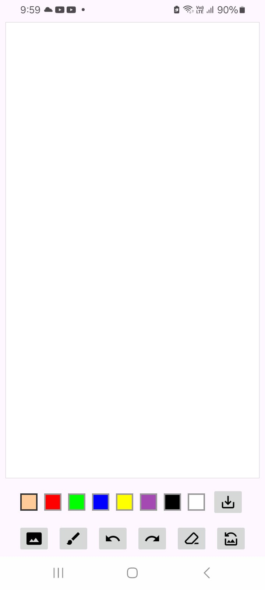

# 🎨 Kids Drawing App

Learning Project: Built as part of Android Development with Kotlin course on Udemy to master modern Android development practices

A simple and intuitive drawing application built for kids to unleash their creativity through touch gestures. Features include brush customization, color selection, undo/redo actions, and the ability to save drawings to the device gallery.

---

## 📷 Screenshots

<p align="center">
  
  
  
</p>

---

## 📚 About This Project
This app was built as part of my Android development learning journey, following the Android Development with Kotlin course by Denis Panjuta on Udemy.

What I Learned:
- Custom View implementation with Canvas and Path APIs
- Efficient bitmap management and memory optimization
- Runtime permission handling for Android 6.0+
- MediaStore API for saving content to device storage
- ViewModel pattern for state management
- Stack-based undo/redo implementation

While the project structure follows the course curriculum, I coded every feature hands-on to deeply understand Android's drawing capabilities and best practices for building performant, user-friendly applications.

---

## ✨ Features

- ✍️ Free-hand Drawing - Draw using touch gestures with smooth, continuous strokes
- 🖌️ Brush Customization - Adjustable brush sizes and extensive color palette
- ↩️ Undo / Redo - Stack-based state management for easy mistake correction
- 💾 Save to Gallery - Save drawings directly to device storage using MediaStore API
- 📂 Canvas Preview - Preview your artwork before saving
- 🔒 Runtime Permissions - Seamless permission handling for media access (Android 6.0+)
- ⚡ Optimized Performance - Efficient bitmap management and caching to prevent ANRs 

---

## 🧩 Tech Stack

- **Language: Kotlin**
- **UI Framework: Android View System**
- **Drawing: Canvas API, Path API**
- **Storage: MediaStore API**
- **Architecture: ViewModel pattern**
- **Permissions: Runtime permission handling (READ/WRITE_EXTERNAL_STORAGE)**

---

## 🏗️ Architecture

This app follows modern Android development practices:

- Custom View implementation for drawing canvas
- ViewModel for managing UI state and drawing history
- Path API for smooth curve rendering
- Bitmap caching for memory optimization

---

## 📋 Prerequisites
- Android Studio (latest version recommended)
- Minimum SDK: API 21 (Android 5.0 Lollipop)
- Target SDK: API 34 (Android 14)
- Kotlin 1.9+

---

## 🚀 Getting Started
Clone the Repository
git clone https://github.com/codingwithrohit/Kids-Drawing-App.git
cd Kids-Drawing-App

Open in Android Studio
1. Open Android Studio
2. Select File > Open
3. Navigate to the cloned repository folder
4. Click OK and let Gradle sync

Run the App
1. Connect an Android device or start an emulator
2. Click the Run button (▶️) in Android Studio
3. Select your device and click OK

---

## 🎯 Key Implementation Highlights
Custom Drawing Logic
```kotlin
// Smooth path drawing with Canvas API
canvas.drawPath(drawPath, drawPaint)
```
Undo/Redo with Stack Management
```kotlin
// Push current state to history stack
pathsStack.push(currentPath)
// Pop to undo last action
pathsStack.pop()
```

MediaStore Integration
```kotlin
// Save drawing to device gallery
val contentValues = ContentValues().apply {
    put(MediaStore.Images.Media.DISPLAY_NAME, "drawing_${timestamp}.png")
    put(MediaStore.Images.Media.MIME_TYPE, "image/png")
}
```

🔧 Permissions Required
```xml
<uses-permission android:name="android.permission.READ_EXTERNAL_STORAGE"/>
<uses-permission android:name="android.permission.WRITE_EXTERNAL_STORAGE"
    android:maxSdkVersion="28"/>
<uses-permission android:name="android.permission.READ_MEDIA_IMAGES/>
```
Note: Permissions are handled at runtime following Android best practices.

---

## 🤝 Contributing
Contributions are welcome! If you'd like to improve this project:
1. Fork the repository
2. Create a feature branch (git checkout -b feature/AmazingFeature)
3. Commit your changes (git commit -m 'Add some AmazingFeature')
4. Push to the branch (git push origin feature/AmazingFeature)
5. Open a Pull Request

---

## 👤 Author
Rohit Kumar

- 🔗 LinkedIn: [linkedin.com/in/rohit-kumar-sde](https://www.linkedin.com/in/rohit-kumar-sde/)
- 📧 Email: [dev.rohitkumar@gmail.com](mailto:dev.rohitkumar@gmail.com)
- 💻 GitHub: [github.com/rohitkumar](https://github.com/rohitkumar)


## 🙏 Acknowledgment

- Built as part of the Android Development with Kotlin course by Denis Panjuta on Udemy
- Course provided structured learning path and project guidance
- Hands-on implementation helped solidify understanding of Android fundamentals
- Thanks to the Android developer community for excellent documentation and resources


---


